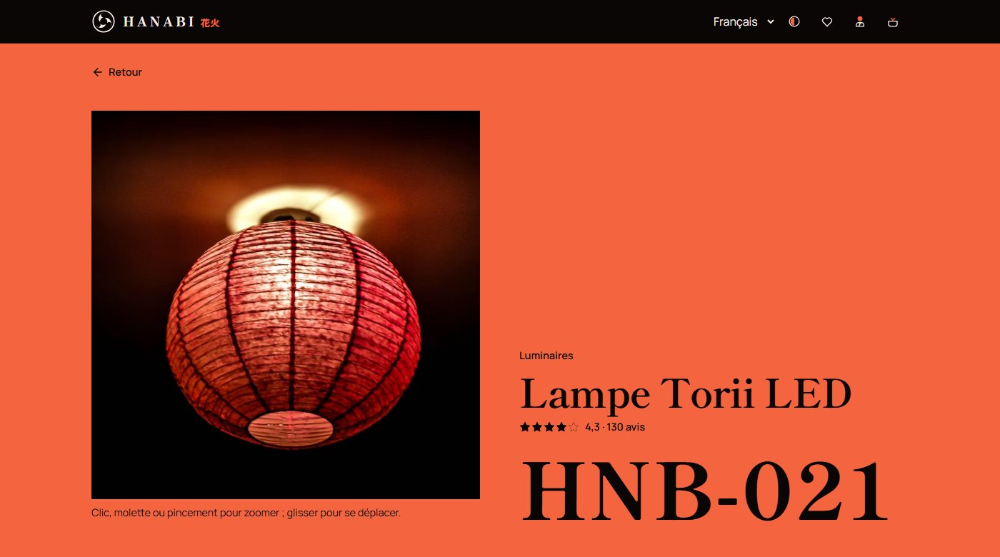
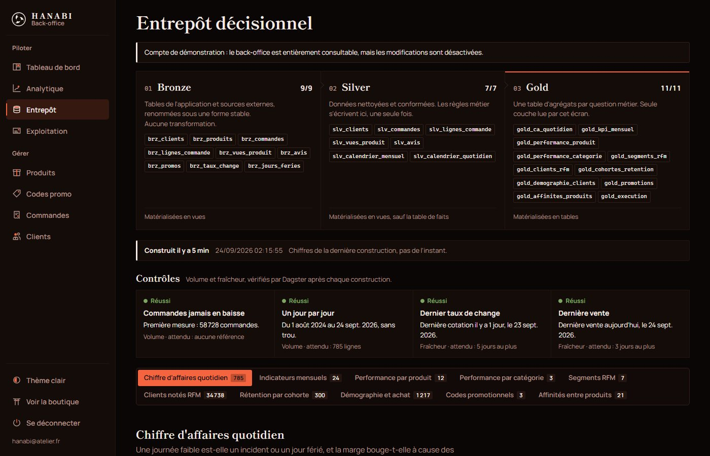

# Hanabi 花火

Boutique en ligne fictive d'objets japonais, avec sa chaîne de données : la
boutique produit les événements, un entrepôt dbt les transforme, le back-office
lit les agrégats.

La boutique sert d'abord de source : 100 000 comptes, 59 000 commandes, 90 000
lignes de commande et 700 000 consultations de fiche à modéliser.

Conçu et développé par Souleiman MECHERI.

[Voir le site](https://hanabi-6x9.pages.dev) ·
[Back-office](https://hanabi-6x9.pages.dev/admin) ·
[L'entrepôt en détail](hanabi-dwh/README.md)


> Boutique fictive, sans activité commerciale. Aucun paiement n'est encaissé et
> aucune commande n'est expédiée.

---

## Aperçu

**Direction artistique.** Deux matières, la laque noire et le vermillon, plus le
papier washi pour le thème clair. Le catalogue réunit figurines, décoration et
luminaires venus des yokai, des estampes et des animés, sans personnage sous
licence. Chaque objet est photographié (photos Unsplash, crédits dans les
mentions légales) ; un objet sans photo reçoit un blason dessiné en SVG, sur la
grammaire des kamon. Titres en Shippori Mincho, texte en Manrope.

La fiche pose l'objet sur une plaque de vermillon pleine largeur. La photo
s'agrandit au clic, à la molette, au pincement ou au clavier.



Panier en tiroir, avec codes promo applicables d'un clic, jauge de livraison
offerte, date de livraison estimée et total recalculé par le serveur.


Le thème suit le réglage du système jusqu'au premier choix, qui est mémorisé.


Sur téléphone, la navigation passe dans un menu en tiroir.


Le back-office reprend la même charte, en plus dense. L'onglet Entrepôt montre
les trois couches, la fraîcheur de la dernière construction, les contrôles de
volume et de fraîcheur, chaque table d'agrégats avec la question qu'elle traite,
et une console SQL en lecture seule. Capture faite sur un entrepôt réellement
construit, à partir d'une base remplie comme celle de production.



---

## La chaîne de données

```
public                 ┐
tables applicatives    │   bronze            silver             gold
écrites par l'API      ├→  9 vues        →   7 modèles      →   11 tables
                       │   aucune            règles métier      une par
externe                │   transformation    écrites une fois   question
2 sources publiques    ┘                                            ↓
BCE et jours fériés                                     back-office + boutique
```

27 modèles dbt, 120 tests, déclarés comme un graphe d'actifs Dagster et
reconstruits chaque jour. Le détail est dans
[hanabi-dwh/README.md](hanabi-dwh/README.md).

**Bronze en vues, colonnes énumérées.** Rien n'est dupliqué, et une colonne
ajoutée à `users` n'entre dans l'entrepôt que si on l'y fait entrer. Le condensat
des mots de passe, les photos en base64 et les coordonnées des clients (nom,
e-mail, téléphone, adresses) restent dehors : un client s'y désigne par son
identifiant.

**Règles métier en silver, écrites une fois.** La définition du chiffre
d'affaires, répétée dans quinze requêtes de l'API, tient dans une colonne
`est_ca`.

**Marge et catégorie figées à l'achat.** Prix, coût et catégorie sont copiés dans
la ligne de commande : un nouveau tarif fournisseur ne réécrit pas les mois clos,
et un objet reclassé emporte son audience et son stock, pas ses ventes passées.
Reclasser la Lampe Torii LED aurait sinon fait passer 258 944 €, 60 % des
luminaires, dans la décoration.

**Séries construites sur le calendrier.** Un mois sans commande sort à zéro au
lieu de disparaître de la courbe.

`dbt build` construit et teste dans l'ordre du graphe : un test en échec bloque
l'aval. Les 120 assertions couvrent unicité, non-nullité, intégrité
référentielle, valeurs acceptées et intervalles. Trois sont des réconciliations :
trois calculs du chiffre d'affaires doivent donner le même nombre, la table des
segments doit totaliser celle des clients, et les familles celle des produits.
Une autre vérifie qu'une construction incrémentale redonne les chiffres d'une
construction complète ; la CI construit l'entrepôt deux fois sur un PostgreSQL
jetable pour la jouer.

### Deux défauts que les tests laissaient passer

Les scores RFM classaient les valeurs distinctes au lieu de la population. Avec
679 anciennetés sur deux ans, « récence 5 » voulait dire « dans les 136
premières valeurs », et non « parmi les 20 % de clients les plus récents ».
Toutes les assertions passaient.

| | avant | après |
| --- | ---: | ---: |
| clients notés R=5 | 73 % | 19,9 % |
| segment « À risque » | 19 clients, 0,1 % du CA | 5 430 clients, 23,1 % du CA |

Chaque valeur est désormais notée au rang médian de son groupe d'ex aequo,
exprimé en part de population.

La référence de `gold_ca_quotidien`, moyenne des quatre jours précédents de même
nature, se calculait en incrémental dans les seuls 30 jours reconstruits. Le premier
jour de chaque nature sortait sans référence, les suivants avec une moyenne sur trop
peu de jours (4 083 € au lieu de 3 606 €), et chaque jour sorti de la fenêtre
restait faux. La construction complète était juste : seule une seconde construction,
incrémentale, le montre. La CI construit désormais deux fois, et un test recalcule
la référence sur la table entière.

### Réseau, concurrence, paiement

**Commande idempotente.** Le navigateur tire une clé avant l'envoi et la répète
en cas de réessai ; le serveur stocke la clé avec sa réponse et la rejoue. L'unicité
repose sur une contrainte de base : un `SELECT` préalable laisserait passer la
seconde requête d'un double envoi.

**Courriel écrit dans la transaction de la commande** (*transactional outbox*).
Une tâche de fond le remet ensuite avec des réessais espacés : une panne du relais
ne fait plus échouer un achat payé. Remise au moins une fois.

**Paiement simulé, échecs jouables.** Le cas délicat est l'issue indécise : un
délai dépassé ne dit pas si le débit a eu lieu. La commande reste alors en attente
de rapprochement, stock retenu, réponse 202. Une première version annulait tout ;
l'annulation emportait la ligne d'idempotence, et le second débit redevenait
possible.

**Stock.** Décrément par `UPDATE ... WHERE stock >= qty` et contrainte
`CHECK (stock >= 0)`. Le test lance douze fils d'exécution derrière une barrière
de départ sur le même article : une seule commande passe.

### Le formulaire de paiement

**La carte se reconnaît sans rien envoyer.** Le réseau se lit aux premiers
chiffres et s'affiche par sa marque ; la banque sort d'une table de 2 379 BIN tirée
de bin-list-data (CC BY 4.0, `scripts/banques.js`), chargée au premier focus du
champ (6 ko). Elle ne garde que les 32 banques que les clients connaissent sous ce
nom : un sous-traitant technique affiché à la place de la banque inquiéterait. Le
service gratuit en ligne (binlist.net) plafonne à cinq requêtes par heure et ne
connaissait pas le BIN français essayé. Seize chiffres dont la clé de Luhn est
fausse sont annoncés comme une faute de frappe, et non comme un numéro incomplet.

**L'adresse se propose.** Les suggestions viennent de la Base Adresse Nationale
(Géoplateforme de l'IGN, gratuite, sans clé) ; en cas de panne, le champ redevient
un champ ordinaire. Le code postal n'accepte que cinq chiffres, sans longueur
maximale sur le champ : elle tronquait un code collé avec une espace avant que le
filtre ne passe. Un code qui ne désigne qu'une commune remplit la ville.

### Le compte

Informations, cartes enregistrées, mot de passe et adresse de connexion.

- **Aucun numéro ni cryptogramme en base** : réseau, quatre derniers chiffres,
  expiration et jeton opaque du prestataire. Le navigateur n'envoie rien d'autre,
  un test le vérifie sur le fil.
- **Mot de passe courant exigé** pour changer ce qui donne accès au compte. La
  nouvelle adresse repart non confirmée.
- **Seuls les champs modifiés partent**, pour ne pas écraser un autre onglet.
- **Aucun identifiant de compte dans les routes** : elles agissent sur le porteur
  du jeton. La carte d'un autre rend 404.

### Effacement et portabilité

Un client peut exporter ses données et supprimer son compte. La suppression
anonymise : le Code de commerce impose de garder dix ans les pièces comptables, ce
que le RGPD prévoit (art. 17-3-b).

| | |
| --- | --- |
| Effacé | moyens de paiement, jetons, alertes de stock, abonnement, courriels en file, adresses de livraison |
| Conservé, délié | commandes et montants, texte des avis, volume de navigation |

L'adresse de remplacement est en `.invalid` (RFC 2606) et le condensat devient une
valeur que bcrypt ne produit jamais. Le test parcourt toutes les colonnes
textuelles du schéma à la recherche des valeurs personnelles : une table oubliée
dans `rgpd.anonymiser` le fait échouer.

### Parcours de bout en bout

Dix-huit parcours Playwright contre une vraie API sur un SQLite jetable, barrières
anti-robots actives. Le plus utile vérifie qu'après une coupure réseau, le réessai
porte la même clé d'idempotence que la première tentative. Un autre paie avec la
carte de test `4000 0000 0000 0002` et attend le refus de la banque : le numéro
reste dans le navigateur, seul le jeton qu'il désigne part au paiement simulé.
Deux surveillent le bandeau cookies : un refus tient au rechargement, et sans
accord la fiche consultée part sans jeton, même pour un client connecté. Quatre
couvrent le formulaire de paiement ; le service d'adresses y répond par une
réponse fixe, pour qu'aucun parcours ne dépende du réseau.

### Cookies et mesure d'audience

Une seule finalité demande un accord : rattacher les fiches consultées au compte
connecté. Le bandeau la présente avec deux boutons identiques, refuser et accepter,
garde le choix six mois (recommandation de la CNIL) et se rouvre depuis « Gérer mes
cookies » en pied de page. Sans accord, la consultation est comptée sans jeton ni
identifiant. Au démarrage, l'API détache du compte les consultations de plus de
treize mois ; l'entrepôt n'utilise que les totaux par produit et par mois.

Les polices sont servies par le site (107 ko, sous-ensembles latin et les six
idéogrammes affichés) : plus aucune requête vers Google. Les photos passent par le
CDN d'Unsplash, qui ne dépose pas de cookie ; la politique de confidentialité le
déclare comme destinataire de l'adresse IP, comme la Géoplateforme de l'IGN qui
reçoit l'adresse en cours de saisie au paiement.

### Courriels promis, courriels envoyés

- **Retour en stock** : la demande faite sur la fiche part au réassort (back-office
  ou commande annulée), une fois, dans la langue de la page, puis se ferme.
- **Désinscription** : chaque lettre porte un lien signé (HMAC du numéro
  d'inscription, sans l'adresse dans l'URL) ; un clic suffit.
- **Confirmation de commande** : elle rappelle l'adresse de livraison, gardée sur
  la commande et effacée avec le compte.

### Accessibilité et poids

Couples de couleurs mesurés dans les deux thèmes, 4,5:1 au minimum, y compris le
texte posé sur le vermillon (`--on-accent`) et les cases de la heatmap des
cohortes. Palette des graphiques validée pour les daltonismes courants ; aucun
statut porté par la couleur seule.

`npm run build` échoue si un lot dépasse son budget :

| lot | transféré (gzip) | plafond |
| --- | ---: | ---: |
| `index` (React et le socle) | 45,4 ko | 51 ko |
| `App` (la boutique) | 60,4 ko | 63 ko |
| `Admin` (chargé à la demande) | 25,0 ko | 28 ko |
| CSS | 16,5 ko | 22 ko |

Le paiement (5 ko) se charge à l'ouverture du panier, avant le clic qui y mène.

### Fluidité

Mesures sur le build de production, écran à 165 Hz :

| | avant | après |
| --- | ---: | ---: |
| Images au premier affichage | 1 956 ko | 246 ko |
| Trames perdues pendant un zoom (molette, glisser) | | 0 |
| Trames perdues au défilement (accueil, fiche) | 0 | 0 |
| Interaction la plus lente (ajout au panier) | | 24 ms |
| Premier affichage / plus grand élément | | 128 / 436 ms |
| Décalage de mise en page cumulé | | 0,002 |

Chaque photo porte un `srcset` : le CDN redimensionne, le navigateur prend la
largeur affichée. `src` est posé en dernier, sinon React lançait le téléchargement
en 1 200 px avant de lire `loading` et `srcset`. La vue principale d'un écran part
en tête de file, les autres vues d'une fiche se préchargent au repos, déjà
décodées. La photo d'une fiche se zoome au clic, à la molette, au pincement ou au
clavier ; le cadrage passe par `transform` sans re-rendu React, et une version en
1 800 ou 2 400 px arrive dès qu'on agrandit. Les sections hors écran (`content-visibility`) ne sont calculées qu'à
l'approche, la jauge du panier avance par `transform` et non par sa largeur, et
ajouter un article ne fait plus re-rendre toute la grille. Sur Cloudflare Pages,
les fichiers à empreinte et les polices sont mis en cache un an (`public/_headers`).

### Exploitation

Chaque requête porte un identifiant, repris dans la réponse et dans des journaux
JSON en production ; les adresses IP y sont tronquées. `/health` fait un
aller-retour jusqu'à la base et répond 503 si elle ne suit pas.

Les courriels sortent par défaut en `.eml` dans `var/courriels/`, message MIME
complet. `MAIL_BACKEND=smtp` bascule sur un vrai relais (voir `.env.example`).
L'onglet Exploitation du back-office affiche la file et les paiements à rapprocher.

### La console SQL

Cinq barrières : transaction en lecture seule, délai de cinq secondes, tables lues
relevées dans le plan `EXPLAIN` (une CTE vers `public.users` est refusée), contrôle
de forme, compte administrateur. Plus une limite de débit, le compte de
démonstration étant public.

### Le compte de démonstration

Ses identifiants sont affichés à la connexion. Il lit tout le back-office et
n'écrit rien, refus posé côté serveur. Toute route qui rend un nom, une adresse
e-mail, une ville ou une adresse de livraison la masque pour lui : clients,
commandes, alertes, tableau de bord, meilleurs clients, segments RFM. L'entrepôt ne
copie aucune coordonnée (un client y est un identifiant), et la console ne lui
ouvre que les agrégats (`gold`).

### L'entrepôt dans la vitrine

« Souvent achetés ensemble » lit `gold_affinites_produits`, trié par lift et limité
aux paires au-dessus de 1.

### Orchestration

Deux extractions Python et 27 modèles dbt forment un seul graphe Dagster. Avant,
les étapes étaient listées à la main dans le workflow et l'extraction des taux
n'y figurait pas : bronze lisait une table que rien n'alimentait. Désormais
`brz_taux_change` dépend de l'extraction et l'ordre se déduit du graphe. Un échec
n'arrête que l'aval, et la série de taux se rejoue par partition mensuelle.

Sans daemon hébergé, GitHub Actions reste l'horloge et appelle le graphe.

### Limite d'architecture

PostgreSQL est un moteur en lignes. À volume analytique réel, le médaillon irait
dans un moteur en colonnes (ClickHouse, DuckDB, BigQuery) et Neon resterait la
source.

---

## En résumé

| Domaine | Réalisations |
| --- | --- |
| Données | Médaillon dbt sur PostgreSQL, 27 modèles, 120 tests, orchestration Dagster par partitions, console SQL bridée |
| Interface | Charte laque et vermillon, photos produit et blasons SVG en repli, thème clair et sombre, 3 langues, menu en tiroir |
| Achat | Panier persistant, articles gardés, favoris, codes promo, livraison estimée, annulation d'un retrait |
| Back-office | Tableau de bord, analytique (rentabilité, prévisions, cohortes, RFM, affinités), entrepôt, exploitation |
| Sécurité | Anti-robots (preuve de travail en Web Worker, pot de miel, délai de saisie), limitation par compte et par IP, en-têtes durcis |
| Fiabilité | Commande idempotente, outbox transactionnelle, stock concurrent, journal structuré |
| Conformité | Mentions légales, CGV versionnées et acceptées côté serveur, RGPD art. 17 et 20, bandeau de consentement, polices hébergées sur le site |
| Accessibilité | Focus piégé dans les fenêtres, clavier, contraste mesuré, `prefers-reduced-motion` |
| Qualité | 487 tests API sur SQLite et PostgreSQL, 257 tests d'interface, 18 parcours e2e, 120 assertions dbt, 14 tests des contrôles de l'entrepôt, budget de poids |

---

## Stack

React 18 et Vite, sans bibliothèque de composants, de CSS, de routage ni
d'animation. Seule dépendance d'exécution en plus de React : `lucide-react`.

FastAPI, SQLAlchemy 2 et Pydantic v2 ; SQLite en local, PostgreSQL (Neon) en
production ; JWT et bcrypt.

dbt sur PostgreSQL, orchestré par Dagster.

---

## Démarrer en local

Prérequis : Node 20+ et Python 3.11+.

```bash
cd hanabi-back
python -m venv .venv
.venv/Scripts/activate
pip install -r requirements.txt
cp .env.example .env
uvicorn app.main:app --reload
```

```bash
cd hanabi-front
npm install
npm run dev
```

Boutique sur `http://localhost:5173`, back-office sur `/admin`, documentation de
l'API sur `http://localhost:8000/docs`.

L'entrepôt est facultatif et demande PostgreSQL :

```bash
cd hanabi-dwh
python -m venv .venv
.venv/Scripts/pip install -r requirements.txt
.venv/Scripts/python dwh.py build
```

Sans entrepôt, l'onglet correspondant affiche la commande à lancer. Le graphe
Dagster s'ouvre sur `http://localhost:3000` :

```bash
cd hanabi-dwh && .venv/Scripts/dagster dev
```

Un client d'essai est créé au démarrage (`demo@hanabi.fr` / `demo1234`).
L'administrateur vient de `ADMIN_EMAIL` et `ADMIN_PASSWORD` ; sans ces variables,
aucun n'est créé.

---

## Tests

```bash
cd hanabi-back && .venv/Scripts/python -m pytest tests/ -q
```

```bash
cd hanabi-front && npm run lint && npm run format:check && npm test && npm run build
```

```bash
cd hanabi-front && npm run e2e
```

```bash
cd hanabi-dwh && .venv/Scripts/dbt parse --profiles-dir . --project-dir . && .venv/Scripts/dagster definitions validate
```

Côté API : prix et remises, stock en concurrence, authentification, anti-robots,
cloisonnement du back-office, export CSV, notation RFM, anonymisation, migrations.
La suite tourne sur SQLite, et la CI la rejoue sur PostgreSQL 16, le moteur de la
production : verrous de ligne, types et contraintes que SQLite laisse passer.

Côté interface, les tests visent des propriétés plutôt que des valeurs figées :

- le lissage Fritsch-Carlson des courbes ne dépasse jamais les points mesurés
  (échantillonnage des Bézier produites) ;
- les dictionnaires anglais et espagnol couvrent toutes les clés du français, avec
  les mêmes marqueurs ;
- frais de port et seuil de gratuité sont comparés entre `lib/constants.js` et
  `app/pricing.py`.

Ces tests ont trouvé deux défauts à leur première exécution : `niceTicks` rendait
une graduation haute sous le maximum de la série, et `estimateDelivery` gardait
l'heure de la commande.

---

## Structure

```
hanabi-back/          API FastAPI
  app/
    routers/          points d'entrée HTTP
    pricing.py        calcul des montants
    analytics.py      calculs du back-office sur la base transactionnelle
    warehouse.py      lecture des agrégats dbt, console SQL
    rgpd.py           portabilité et effacement
    idempotency.py    rejeu des requêtes non répétables
    outbox.py         file des courriels
    payments.py       autorisation simulée
    observability.py  identifiant de requête, journal structuré
  tests/

hanabi-front/         Interface React
  src/
    components/ pages/ hooks/ lib/ i18n/
    styles/           charte et CSS par domaine
    admin/            back-office, chargé à la demande
  e2e/                parcours Playwright

hanabi-dwh/           Entrepôt (dbt + Dagster)
  models/bronze/ models/silver/ models/gold/
  ingestion/          sources publiques (BCE, jours fériés)
  orchestration/      graphe d'actifs
```

Conventions et pièges connus : [CONTRIBUTING.md](CONTRIBUTING.md).

---

## Limites connues

- **Paiement non branché.** La carte est validée (Luhn, réseau) mais rien ne
  quitte le navigateur ; un vrai branchement passerait par les composants du
  prestataire.
- **Banque indicative.** La table des BIN n'est pas officielle et date de février
  2025 ; sur un BIN qu'elle ne connaît pas, elle n'affiche rien plutôt que de deviner.
- **Photos en base64 dans la base** pour celles qu'on téléverse depuis le
  back-office. La réponse du catalogue grossit avec elles ; la suite logique est un
  stockage objet.
- **Un seul cliché par objet**, que l'on agrandit à volonté : Unsplash n'a pas
  d'autre angle de ces objets précis. De vraies prises de vue compléteraient les
  galeries.
- **Reconstruction planifiée conditionnée à `DWH_DATABASE_URL`** dans les secrets du
  dépôt. GitHub désactive aussi les tâches planifiées après soixante jours sans
  activité.
- **Mentions légales à compléter.** Aucune identité d'entreprise n'est inventée.
- **Anti-robots en mémoire du processus.** Plusieurs instances demanderaient Redis.
- **Messages de l'API en français**, quelle que soit la langue de l'interface. Les
  courriels déclenchés depuis une page (lettre, retour en stock) suivent sa langue.
- **Panier et favoris en `localStorage`**, donc propres à un appareil.

---

## Mise en ligne

[DEPLOY.md](DEPLOY.md) : hébergement gratuit, variables d'environnement,
vérifications.

## Auteur

Souleiman MECHERI : conception, interface, API, chaîne de données, sécurité, mise
en ligne.

## Licence

Tous droits réservés, voir [LICENSE](LICENSE). Code consultable pour évaluation ;
reproduction, redistribution, modification et usage commercial soumis à accord
écrit.

Une faille à signaler : [SECURITY.md](SECURITY.md).
