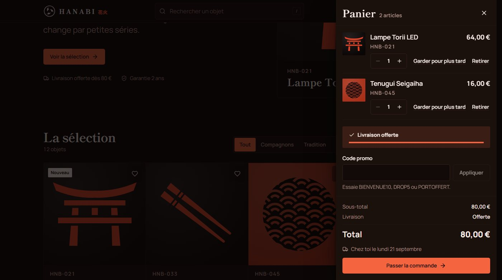
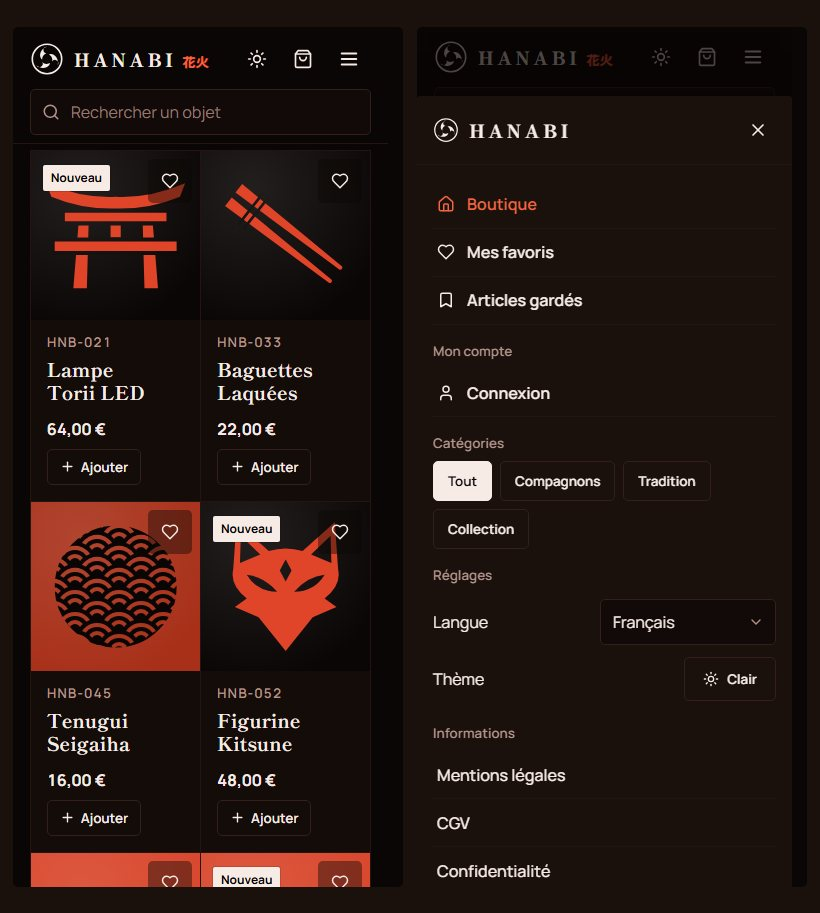

# Hanabi 花火

Boutique en ligne fictive d'objets japonais, doublée d'une chaîne de données
complète : la boutique produit les événements, un entrepôt dbt les transforme,
et le back-office lit les agrégats.

L'application n'est pas vraiment le sujet. Elle existe pour qu'il y ait de
vraies données à modéliser, plutôt qu'un CSV téléchargé sur Kaggle : 100 000
comptes, 59 000 commandes, 90 000 lignes de commande, 700 000 consultations de
fiche.

Conçu et développé par Souleiman MECHERI.

[Voir le site](https://hanabi-6x9.pages.dev) ·
[Back-office](https://hanabi-6x9.pages.dev/admin) ·
[L'entrepôt en détail](hanabi-dwh/README.md)


> Boutique fictive, sans activité commerciale. Aucun paiement n'est encaissé et
> aucune commande n'est expédiée.

---

## Aperçu

Panier avec code promo, jauge de livraison offerte, date de livraison estimée,
et montant systématiquement recalculé côté serveur.



Thème clair aligné sur le réglage du système tant que personne n'a touché au
bouton, puis mémorisé.


Sous 640 px, l'en-tête se vide au profit d'un menu en tiroir et les actions
principales rejoignent la barre du bas.



---

## La chaîne de données

```
public                 ┐
tables applicatives    │   bronze            silver             gold
écrites par l'API      ├→  9 vues        →   7 modèles      →   11 tables
                       │   aucune            règles métier      une par
externe                │   transformation    écrites une fois   question
2 sources publiques    ┘                                            ↓
BCE et jours fériés                                     back-office + boutique
```

27 modèles dbt en trois couches, 112 tests de transformation, le tout déclaré
comme un graphe d'actifs Dagster et reconstruit chaque jour. Le détail vit dans
[hanabi-dwh/README.md](hanabi-dwh/README.md) ; voici les décisions qui comptent.

**Bronze en vues, colonnes énumérées.** Aucune donnée dupliquée. Une colonne
ajoutée à `users` ne se propage pas en silence : il faut passer par bronze,
donc décider si elle a sa place. Le condensat des mots de passe et les photos
en base64 n'entrent jamais dans l'entrepôt.

**Les règles métier vivent en silver, écrites une seule fois.** La définition
du chiffre d'affaires était répétée dans quinze requêtes de l'API. Elle tient
maintenant dans une colonne `est_ca`. Une règle écrite quinze fois finit
toujours par différer quelque part.

**La marge est figée à l'achat.** `unit_price_cents` et `unit_cost_cents` sont
copiés dans la ligne de commande. Un changement de tarif fournisseur ne doit
pas réécrire le résultat des mois déjà clos.

**Les séries partent du calendrier**, pas des faits. Un mois sans commande
sort à zéro au lieu de disparaître, sinon la courbe se resserre et laisse
croire à une activité continue.

Sur la qualité, `dbt build` construit et teste dans l'ordre du graphe : un
modèle dont un test échoue bloque ce qui en dépend, au lieu de propager une
donnée fausse jusqu'au tableau de bord. Les 112 assertions couvrent l'unicité,
la non-nullité, l'intégrité référentielle, les valeurs acceptées et les
intervalles. Deux d'entre elles sont des réconciliations croisées : trois
chemins de calcul du chiffre d'affaires doivent tomber sur le même nombre, et
la table des segments doit totaliser la table des clients. L'une teste même une
égalité avec un écart attendu non nul, la segmentation excluant les commandes
invitées.

### Le bug que les tests n'auraient pas trouvé

Les scores RFM classaient les valeurs distinctes et non la population. Avec 679
anciennetés étalées sur deux ans, « score de récence 5 » voulait dire « dans
les 136 premières valeurs de l'échelle », pas « parmi les 20 % de clients les
plus récents ». Toutes les assertions passaient : les scores étaient bien entre
1 et 5, les totaux tombaient juste.

| | avant | après |
| --- | ---: | ---: |
| clients notés R=5 | 73 % | 19,9 % |
| segment « À risque » | 19 clients, 0,1 % du CA | 5 430 clients, 23,1 % du CA |

Le segment où une relance a le plus de valeur, des clients qui ont prouvé
qu'ils achetaient et ne reviennent plus, était réduit à dix-neuf personnes par
un artefact de calcul. La correction note chaque valeur par le rang médian de
son groupe d'ex aequo, exprimé en part de population. Les ex aequo partagent
toujours leur score, et le découpage porte enfin sur la population.

### Ce qui casse quand le réseau s'en mêle

Un tunnel d'achat n'échoue presque jamais sur sa logique métier. Il échoue parce
qu'un client clique deux fois, parce qu'un relais de messagerie ne répond plus,
ou parce que deux personnes veulent le même dernier article. Trois mécanismes
répondent à ces trois cas, et ils tiennent ensemble.

**La commande est idempotente.** Le client tire une clé au hasard avant
d'envoyer et la répète s'il réessaie ; le serveur enregistre la clé avec la
réponse produite et rejoue celle-ci à la deuxième présentation. L'unicité est
portée par une contrainte de base, jamais par un `SELECT` préalable : entre une
lecture qui ne trouve rien et l'insertion qui suit, la seconde requête d'un
double-clic passe. La contrainte tranche, le perdant traite la violation comme
un réessai.

**Le courriel de confirmation est écrit dans la transaction de la commande**,
pas envoyé depuis la requête. S'il y a commande, il y a courriel : la garantie
vient de la base. Une tâche de fond le remet ensuite, avec des réessais espacés
exponentiellement, si bien qu'une panne du relais ne peut plus faire échouer un
achat déjà payé. C'est le motif *transactional outbox*, dont la limite est
assumée : la remise est au-moins-une-fois, jamais exactement-une-fois.

**Le paiement est simulé, mais ses chemins d'échec sont jouables.** Aucun argent
ne circule et rien ne saurait l'encaisser. L'étape existe parce qu'elle change
la nature des garde-fous autour : rejouer une insertion est bénin, rejouer un
débit ne l'est pas. Le cas intéressant est l'issue **indécise** — un délai
dépassé ne dit pas si le débit a eu lieu. On ne peut ni confirmer, ce serait
livrer un paiement non prouvé, ni annuler, ce serait oublier un débit possible
et rendre un stock peut-être déjà vendu. La commande reste donc en attente de
rapprochement, stock retenu, et la réponse est un 202.

Une première version annulait tout et invitait à réessayer avec la même clé.
C'était une promesse creuse, et une sonde en conditions réelles l'a montrée :
l'annulation emportait aussi la ligne d'idempotence, qui vit dans la même
transaction. La clé disparaissait, le réessai repartait de zéro, et le second
débit qu'on prétendait empêcher redevenait possible.

Sur la concurrence, le décrément passe par un `UPDATE ... WHERE stock >= qty`
dont le `rowcount` décide, avec une contrainte `CHECK (stock >= 0)` en filet
dernier. La suite lance de vrais fils d'exécution derrière une barrière de
départ : douze acheteurs sur un article, une seule commande. Le test qui
existait auparavant s'appelait « concurrentes » mais envoyait ses requêtes l'une
après l'autre — il ne mettait jamais deux appels en vol ensemble, ce qui est
précisément là où l'entrelacement se produit.

### Le compte, et ce qu'on n'y stocke pas

Un client peut modifier ses informations, enregistrer des cartes, changer son
mot de passe et son adresse de connexion. Trois décisions méritent d'être
défendues.

**La table des moyens de paiement ne contient ni numéro ni cryptogramme.**
Réseau, quatre derniers chiffres, expiration, et un jeton opaque du
prestataire — exactement ce qu'une intégration réelle conserve. Le numéro est
réduit dans le navigateur à ce qui sert à reconnaître la carte, et rien d'autre
n'est construit, donc rien d'autre ne peut partir. Vérifié sur le fil, et un
test échoue si un jour quelqu'un ajoute le numéro « juste pour déboguer ». On ne
se fait pas voler ce qu'on ne détient pas : c'est ce qui maintient l'application
hors du périmètre PCI-DSS.

**Deux niveaux d'exigence.** Modifier le contenu du compte demande d'être
connecté ; modifier ce qui en donne l'accès — mot de passe, e-mail — demande en
plus le mot de passe courant. Une session prouve qu'on était là il y a douze
heures, pas qu'on est là maintenant, et un poste laissé ouvert suffirait sinon à
verrouiller le propriétaire dehors. La nouvelle adresse repart non confirmée,
avec un lien : sans cela, il suffirait de confirmer une adresse quelconque puis
d'en déclarer une autre.

**Le formulaire n'envoie que ce qui a changé.** Le serveur distingue « champ
absent » de « champ vide », et reposter l'objet entier écraserait avec des
valeurs périmées ce qu'un autre onglet vient de modifier.

Aucune de ces routes ne prend d'identifiant de compte : elles agissent sur le
porteur du jeton. Il n'y a pas de `?user_id=2` à falsifier parce qu'il n'y a pas
de paramètre. La carte d'un autre rend 404, jamais 403 — un 403 confirmerait son
existence.

### La bizarrerie qui cassait tout le tunnel d'achat au téléphone

Le formulaire de commande débordait de l'écran à 375 px. Pas mal rogné : il
refusait de rétrécir.

`<fieldset>` porte un `min-width: min-content` implicite dans tous les
navigateurs, que rien dans la feuille de style ne laisse deviner et qu'aucun
autre élément ne partage. Un `<div>` identique se comprime, un `<fieldset>` non.
Combinée à une piste de grille `1fr` — dont le minimum implicite est
`min-content`, pas zéro — elle imposait 371 px dans un conteneur de 343.

Deux lignes corrigent les deux causes : `fieldset { min-width: 0 }` et
`minmax(0, 1fr)`. Le défaut était antérieur à la refonte du compte, et se
serait vu sur n'importe quel téléphone.

### Ce que les tests unitaires ne peuvent pas voir

Huit parcours Playwright, dans un vrai navigateur, contre une vraie API. Les
tests unitaires vérifient des pièces, les tests d'API vérifient des contrats ;
aucun des deux ne répond à « est-ce qu'on peut acheter ». Entre les deux vivent
le câblage, le routage, la sérialisation et l'état partagé — et c'est là que
casse un tunnel d'achat.

L'API démarrée pour ces tests pointe sur un SQLite jetable, jamais sur une base
réelle : un parcours d'achat **écrit**, il décrémente du stock et crée des
commandes. Les barrières anti-robots, elles, ne sont pas désactivées — le
parcours les traverse pour de vrai.

Le test le plus intéressant est **le réessai après coupure réseau**.
L'idempotence repose sur une clé tirée par le navigateur et conservée entre deux
tentatives ; les tests d'API la vérifient en envoyant deux fois la même clé,
mais rien ne prouvait que le navigateur la répète vraiment. Une clé régénérée à
chaque appel passerait tous les tests serveur et ne protégerait de rien.

Le scénario a changé en cours d'écriture, et l'échec du premier était
instructif : un double-clic littéral est **impossible** par l'interface,
puisque le bouton se désactive pendant l'envoi puis disparaît avec l'écran. La
clé ne protège donc pas là où on la croyait — elle protège du réessai après une
coupure, et c'est ce cas-là qui est reproduit.

### Le poids ne dérive pas tout seul

`npm run build` échoue si un lot dépasse son budget. Un chiffre affiché en fin
de construction ne change rien : on le lit une fois, on l'oublie, et le poids
monte de trois kilo-octets par semaine sans qu'aucune journée ne soit fautive.

| lot | transféré (gzip) | plafond |
| --- | ---: | ---: |
| `index` — React et le socle | 45,4 ko | 51 ko |
| `App` — la boutique | 55,9 ko | 63 ko |
| `Admin` — chargé à la demande | 24,2 ko | 28 ko |
| CSS | 19,2 ko | 22 ko |

Les plafonds sont mesurés puis arrondis avec environ 12 % de marge. Un budget
deviné trop large ne signale jamais rien : j'avais estimé le back-office à 90 ko,
il en fait 24.

### Effacer sans détruire

Un client peut récupérer toutes ses données et supprimer son compte. Le second
point est plus subtil qu'il n'y paraît, et **ce n'est pas un `DELETE`**.

Effacer la ligne d'un client détruirait ses commandes, or le Code de commerce
impose de conserver dix ans les pièces comptables. Le RGPD le prévoit :
l'article 17-3-b écarte le droit à l'effacement lorsqu'une obligation légale
s'y oppose. Les deux textes ne se contredisent pas — ils délimitent.

On **anonymise** donc. Tout ce qui identifie une personne disparaît, tout ce qui
fait foi comptablement reste. Une commande conserve sa date, ses montants et ses
lignes ; elle ne conserve plus de nom, d'adresse ni de courriel. Ce qui subsiste
n'est plus une donnée personnelle, et sort du champ du règlement.

| | |
| --- | --- |
| Effacé sans condition | moyens de paiement, jetons, alertes de stock, abonnement, courriels en file |
| Conservé, délié | commandes et montants, texte des avis, volume de navigation |

L'adresse de remplacement utilise le domaine `.invalid`, réservé par la
RFC 2606 : un courriel envoyé par erreur ne partira jamais nulle part. Le
condensat est remplacé par une valeur que bcrypt ne peut pas produire, ce qui
rend le compte inaccessible sans dépendre d'un drapeau que chaque nouvelle route
devrait penser à vérifier.

Deux confirmations sont exigées : le mot de passe prouve qu'on est là
*maintenant* — une session prouve seulement qu'on y était il y a douze heures —
et une formule recopiée prouve qu'on a lu ce qui va se passer.

**Le test qui compte procède par balayage.** Il ne coche pas les tables
auxquelles on a pensé : il parcourt toutes les colonnes textuelles du schéma et
cherche les valeurs personnelles. Une table ajoutée plus tard et oubliée dans
`rgpd.anonymiser` le fera échouer sans qu'on ait rien à y ajouter — vérifié en
retirant volontairement une étape, le test nomme alors la colonne fautive.

Limite assumée : le texte des avis reste en ligne sous un auteur anonyme. Un
avis parle d'un produit et les autres clients s'y fient ; si quelqu'un y a écrit
son nom, aucune analyse automatique ne peut le savoir. La réponse le dit et
oriente vers une suppression sur demande.

### Le contraste, mesuré plutôt que supposé

Un audit automatisé parcourt tous les textes affichés, compose les fonds
translucides couche par couche et calcule le ratio réel. Il a trouvé **sept
échecs WCAG AA**, tous dus à la même cause : `color: #fff` écrit en dur sur les
aplats vermillon, seize fois.

Le jeton `--on-accent` existait depuis le début et n'était utilisé **nulle
part**. Sur le vermillon clair du thème sombre, le blanc donne 3,12:1 ; le noir
de laque donne 6,4:1 — et c'est plus fidèle au negoro, où le vermillon recouvre
le noir, pas du blanc.

Le thème clair a révélé un second défaut, structurel celui-là : le pied de page
reste sombre quel que soit le thème, mais son accent, lui, suivait le thème. En
clair, du vermillon foncé sur du noir donnait 3,79:1. Une surface qui ne change
pas veut des couleurs qui ne changent pas — d'où un `--footer-accent` constant.

Le vermillon du thème clair a été assombri de `#c33a20` à `#ad3116`, valeur
trouvée en essayant les candidats un par un contre les quatre fonds réellement
rencontrés. C'est la **première** qui passe partout ; chaque cran de plus
rapprocherait du brun.

Résultat : **zéro échec sur 164 textes, dans les deux thèmes.**

### L'acceptation des conditions de vente

Obligatoire en vente à distance, et vérifiée **côté serveur** — une case qui ne
vit que dans le navigateur se contourne depuis la console.

Ce n'est pas un booléen mais une **version** qui est enregistrée sur la
commande, avec sa date. Les conditions évoluent ; savoir qu'une personne a coché
une case ne dit pas ce qu'elle a accepté, et c'est précisément ce qu'il faut
pouvoir prouver.

La case n'est jamais pré-cochée, et se trouve juste au-dessus du bouton de
paiement : plus haut elle serait oubliée, en dessous elle arriverait après la
décision.

### Savoir ce qui s'est passé

Chaque requête porte un identifiant, repris du client s'il en fournit un et
renvoyé dans la réponse. Les journaux sortent en JSON dès que `ENV=prod`, avec
les champs métier posés par l'appelant plutôt que noyés dans du texte libre :
on retrouve une commande par une recherche sur un champ, pas par une expression
régulière. Les adresses IP y sont tronquées à leur préfixe réseau — assez pour
reconnaître une source abusive, pas assez pour suivre une personne.

La sonde `/health` exécute un aller-retour réel jusqu'à la base et répond 503 si
elle ne répond pas. L'ancienne version renvoyait `{"status": "ok"}` en dur :
elle ne prouvait que la présence du processus Python, alors que la panne la plus
fréquente est en aval. Une base en veille laissait la sonde au vert pendant que
chaque page renvoyait une erreur.

### Les courriels partent vraiment

Par défaut, chaque message est écrit dans `var/courriels/` au format `.eml`,
ouvrable d'un double-clic. Ce n'est pas un bouchon : c'est le message complet,
en-têtes MIME compris, celui-là même qui partirait sur le réseau. Le dépôt reste
donc clonable sans identifiants, ce qu'un SMTP par défaut interdirait.

Renseigner `MAIL_BACKEND=smtp` et un hôte bascule sur un vrai relais, sans une
ligne de code supplémentaire — `smtplib` de la bibliothèque standard suffit.
Brevo, Resend et Gmail ont tous une offre gratuite largement suffisante ici.
Voir `.env.example`, qui donne les trois configurations et le piège du port :
587 passe en TLS après ouverture, 465 chiffre dès l'ouverture, et les confondre
produit une attente muette jusqu'au délai d'expiration.

### La console SQL

Le back-office ne se contente pas d'afficher les agrégats : la requête est
modifiable et rejouable. C'est ce qui sépare un entrepôt d'un tableau de bord
de plus.

Ouvrir une saisie SQL libre dans une interface web se paie, alors c'est refermé
par cinq barrières indépendantes : transaction en lecture seule, délai
d'exécution de cinq secondes, examen du plan pour connaître les tables
réellement lues, contrôle de forme, authentification administrateur.

La troisième est la plus intéressante. Les tables sont demandées à `EXPLAIN`
plutôt que devinées par expression régulière, si bien qu'une fuite vers
`public.users` par CTE, sous-requête ou jointure est refusée là où un filtre
sur le texte se laisserait contourner. `public` n'est jamais lisible, c'est là
que vivent les condensats de mots de passe.

### L'entrepôt sert aussi la vitrine

La rubrique « Souvent achetés ensemble » d'une fiche produit lit
`gold_affinites_produits`. Les suggestions ne viennent donc pas d'une règle
écrite à la main comme « même catégorie », mais des paniers réels. Le tri se
fait sur le lift plutôt que sur la confiance, laquelle se laisse tromper par
les best-sellers, et seules les paires au-dessus de 1 apparaissent : en
dessous, les articles se substituent au lieu de se compléter.

### L'orchestration, et le défaut qu'elle a révélé

La chaîne est déclarée comme un graphe d'actifs Dagster : deux extractions
Python et 27 modèles dbt, de la table écrite par l'API jusqu'à l'agrégat lu par
le back-office.

Ce n'est pas venu d'une envie d'outil. Les étapes étaient énumérées à la main
dans le workflow GitHub, et l'extraction des sources externes n'y figurait
pas : `externe.taux_change` n'était rechargée que lorsque quelqu'un y pensait,
alors même que le projet déclare une source périmée au bout de dix jours. Bronze
lisait une table que rien n'alimentait.

Une étape manquante dans une liste écrite à la main ne se voit pas. Une
dépendance manquante dans un graphe, si : `brz_taux_change` déclare dépendre de
l'extraction, et l'ordre se déduit de cette déclaration au lieu d'être
retranscrit ailleurs. Trois conséquences suivent : un échec cesse d'être binaire
et n'arrête que l'aval du nœud tombé, la série de taux se découpe en partitions
mensuelles qu'on rejoue une par une, et 96 des 112 assertions dbt deviennent des
contrôles attachés au modèle qu'elles vérifient.

Une exécution complète matérialise 29 actifs en une minute et demie : les deux
extractions, puis les 27 modèles construits et testés. Les 96 contrôles passent,
et la réconciliation croisée tombe à zéro d'écart : la somme des commandes
facturées dans la base transactionnelle et le total de `gold_kpi_mensuel`
donnent le même nombre au centime.

Ce que Dagster n'apporte pas, en revanche : rien côté planification. Un
calendrier Dagster suppose un daemon permanent et rien n'en héberge un, donc
c'est toujours GitHub Actions qui donne l'heure, en appelant simplement le
graphe au lieu de redire les étapes. À 27 modèles et une minute de
construction, seul le défaut ci-dessus justifiait l'outil ; le reste est réel
mais modeste, et le README de l'entrepôt le dit dans ces termes.

### Ce que cette architecture ne résout pas

PostgreSQL est un moteur en lignes. Sur des volumes analytiques réels, un
médaillon a sa place dans un moteur en colonnes comme ClickHouse, DuckDB ou
BigQuery, et Neon ne serait plus que la source d'ingestion. À l'échelle de
cette boutique, la démarche vaut pour ce qu'elle discipline, pas pour ce
qu'elle accélère. C'est un choix assumé, pas une méconnaissance de la limite.

---

## Ce que le projet démontre

| Domaine | Réalisations |
| --- | --- |
| Données | Entrepôt médaillon (dbt sur PostgreSQL), 27 modèles, 112 tests, orchestration Dagster avec lignage bout en bout et rattrapage par partitions, console SQL bridée, reconstruction planifiée |
| Interface | Thème clair/sombre suivant le système, 3 langues, menu en tiroir, cartes en 3D au survol, feux d'artifice en canvas, le tout coupé si le système demande de réduire les animations |
| Parcours d'achat | Panier persistant, articles gardés pour plus tard, favoris, codes promo, livraison estimée, historique de commandes |
| Sécurité | Anti-robots maison (preuve de travail en Web Worker, pot de miel, délai de saisie), limitation par compte et par IP, politique de mot de passe côté serveur, en-têtes durcis |
| Métier | Prix recalculés côté serveur, décrément de stock atomique, avis vérifiés par achat |
| Conformité | Mentions légales, CGV, RGPD et cookies rédigés pour le droit français |
| Accessibilité | Piège de focus dans les modales, navigation clavier, `aria-invalid`, respect de `prefers-reduced-motion` |
| Fiabilité | Commande idempotente, file de courriels transactionnelle, décrément de stock concurrent, journal structuré avec identifiant de requête |
| Compte | Informations modifiables, moyens de paiement enregistrés, changement de mot de passe et d'adresse |
| Conformité | Portabilité et effacement (RGPD art. 20 et 17), acceptation tracée des CGV |
| Accessibilité | Contraste WCAG AA vérifié sur 164 textes, dans les deux thèmes |
| Qualité | 393 tests côté API, 188 côté interface, 9 parcours de bout en bout, 112 assertions dbt, budget de poids appliqué à la construction |

---

## Stack

React 18 et Vite côté interface, sans bibliothèque de composants ni de CSS. Une
seule dépendance d'exécution en dehors de React, `lucide-react` pour les icônes.

FastAPI, SQLAlchemy 2, Pydantic v2 côté API, avec SQLite en développement et
PostgreSQL (Neon) en production. JWT et bcrypt pour l'authentification.

dbt sur PostgreSQL pour l'entrepôt, trois schémas en architecture médaillon,
orchestrés par Dagster - les modèles dbt et les extractions Python y forment un
seul graphe d'actifs.

Le parti pris est assumé : pas de framework CSS, pas de routeur, pas de
bibliothèque d'animation. Chaque brique est écrite à la main pour montrer la
mécanique plutôt que la configuration.

---

## Quelques décisions techniques

**Navigation par URL sans routeur.** Sept écrans, une table de correspondance
et l'API History. Les fiches produit sont partageables et les boutons Retour et
Suivant fonctionnent.

**Les montants sont des entiers de centimes.** Le suffixe `_cents` est
obligatoire, le formatage se fait à l'affichage. Toute arithmétique en flottant
sur un prix est un bug.

**Le stock se décrémente par `UPDATE … WHERE stock >= qty`**, pas par lecture
puis écriture. Deux acheteurs simultanés sur le dernier article ne doivent pas
passer tous les deux.

**La preuve de travail anti-robots tourne dans un Web Worker.** Elle vivait
dans la page et rendait la main toutes les deux mille tentatives, mais chaque
tentative faisait `await crypto.subtle.digest(...)` : une promesse déjà résolue
ne cède qu'à la file de microtâches, vidée avant que le navigateur ne puisse
peindre. Le fil principal restait figé par blocs. Sur un fil séparé, la page ne
le sent plus.

**Aucun filtre SVG dans les visuels produit.** `feGaussianBlur` et
`feTurbulence` donneraient flou et grain à moindre effort, mais un filtre se
rastérise à chaque changement de taille et douze cartes en afficheraient douze.
Toute la profondeur vient de dégradés, rastérisés une fois puis composés sans
repeindre.

---

## Démarrer en local

Prérequis : Node 20+ et Python 3.11+.

L'API d'abord :

```bash
cd hanabi-back
python -m venv .venv
.venv/Scripts/activate
pip install -r requirements.txt
cp .env.example .env
uvicorn app.main:app --reload
```

Puis l'interface, dans un second terminal :

```bash
cd hanabi-front
npm install
npm run dev
```

La boutique répond sur `http://localhost:5173`, le back-office sur `/admin`, et
la documentation interactive de l'API sur `http://localhost:8000/docs`.

L'entrepôt est facultatif, le reste du projet tourne sans. Il demande une base
PostgreSQL, là où la suite se contente de SQLite :

```bash
cd hanabi-dwh
python -m venv .venv
.venv/Scripts/pip install -r requirements.txt
.venv/Scripts/python dwh.py build
```

L'onglet Entrepôt du back-office affiche alors les tables construites, la
requête qui les lit et la date de la dernière construction. Sans entrepôt, il
affiche la marche à suivre plutôt qu'une erreur.

Pour voir la chaîne comme un graphe - lignage, dernière matérialisation de
chaque modèle, tests en échec, partitions manquantes - et la relancer nœud par
nœud, l'interface Dagster s'ouvre sur `http://localhost:3000` :

```bash
cd hanabi-dwh && .venv/Scripts/dagster dev
```

Côté comptes, un client d'essai est créé au démarrage : `demo@hanabi.fr` /
`demo1234`. Le back-office n'est accessible qu'à un compte désigné par
`ADMIN_EMAIL` et `ADMIN_PASSWORD`. Sans ces variables, aucun administrateur
n'est créé, pour qu'une mise en ligne distraite n'ouvre pas l'administration.

---

## Tests

```bash
cd hanabi-back && .venv/Scripts/python -m pytest tests/ -q
```

```bash
cd hanabi-front && npm run lint && npm run format:check && npm test && npm run build
```

```bash
cd hanabi-front && npm run e2e
```

```bash
cd hanabi-dwh && .venv/Scripts/python dwh.py build
```

```bash
cd hanabi-dwh && .venv/Scripts/dbt parse --profiles-dir . --project-dir . && .venv/Scripts/dagster definitions validate
```

393 tests côté API couvrent le calcul des prix et des remises, le décrément de
stock en concurrence, l'authentification, les barrières anti-robots, le
cloisonnement du back-office, l'export CSV et les propriétés de la notation RFM.

188 tests côté interface (Vitest) portent sur ce qui décide plutôt que sur ce
qui s'affiche : validation de carte, estimation de livraison, table des URL,
panier persistant, échelles des graphiques. Trois d'entre eux méritent d'être
signalés parce qu'ils vérifient une **propriété** et non une valeur figée.

- Le lissage des courbes du back-office implémente Fritsch-Carlson, dont
  l'intérêt est de ne jamais dépasser les points mesurés. Le test rejoue les
  courbes de Bézier produites et échantillonne chaque segment : il vérifie la
  garantie, là où comparer la chaîne `d` à une chaîne attendue casserait au
  moindre arrondi tout en laissant passer un vrai dépassement.
- Les dictionnaires anglais et espagnol doivent couvrir toutes les clés du
  français, sans clé orpheline et avec les mêmes marqueurs de substitution. Le
  module avertissait déjà en console ; un avertissement se lit s'il est lu, ce
  test bloque.
- Les frais de port et le seuil de gratuité sont dupliqués entre
  `lib/constants.js` et `app/pricing.py` — nécessaire pour afficher un total
  avant la réponse réseau. Un test lit le fichier Python et compare : la
  duplication reste, la dérive silencieuse non.

Ces tests ont trouvé deux défauts réels dès leur première exécution, tous deux
corrigés : `niceTicks` rendait une graduation haute inférieure au maximum de la
série pour 99,5 % des valeurs, ce qui traçait les points jusqu'à 50 % au-dessus
du cadre ; et `estimateDelivery` conservait l'heure de la commande, si bien que
comparer deux estimations pouvait faire livrer plus tôt une commande passée plus
tard.

Les 112 assertions dbt sont jouées après construction, dans l'ordre du graphe.
La suite Python tourne sur SQLite : rapide, mais aveugle à l'entrepôt qui
n'existe que sur PostgreSQL. Les deux se complètent au lieu de se doubler.

La dernière commande ne demande aucune base : `parse` compile le Jinja et
résout le graphe dbt, `validate` charge les définitions Dagster. Ce sont les
deux vérifications que l'intégration continue joue à chaque poussée.

---

## Structure

```
hanabi-back/          API FastAPI
  app/
    routers/          points d'entrée HTTP
    antibot.py        preuve de travail, pot de miel, limitation des échecs
    passwords.py      politique de mot de passe (NIST SP 800-63B)
    pricing.py        calcul des montants, seule source de vérité
    analytics.py      calculs décisionnels, sur la base transactionnelle
    warehouse.py      lecture des agrégats construits par dbt
    rgpd.py           portabilité et effacement, art. 20 et 17
    idempotency.py    rejeu sûr des requêtes non répétables
    outbox.py         file des courriels, vidée en tâche de fond
    mailer.py         sorties fichier / SMTP / mémoire
    payments.py       autorisation simulée, chemins d'échec jouables
    observability.py  identifiant de requête et journal structuré
  tests/              393 tests

hanabi-front/         Interface React
  src/
    components/       briques d'interface
    pages/            écrans
    hooks/            logique réutilisable
    lib/              utilitaires sans dépendance à React
    i18n/             français, anglais, espagnol
    admin/            back-office, lot séparé chargé à la demande

hanabi-dwh/           Entrepôt décisionnel (dbt)
  models/bronze/      vues sur les tables de l'application et sur les sources externes
  models/silver/      données conformées, règles métier
  models/gold/        une table d'agrégats par question métier
  ingestion/          extraction des sources publiques (BCE, jours fériés)
  orchestration/      graphe d'actifs Dagster, du chargement jusqu'à gold
  dwh.py              lanceur, reprend la connexion de l'API
```

---

## Limites connues

**Le paiement n'est pas branché.** Le tunnel valide la carte (Luhn, détection
du réseau) mais aucune donnée bancaire ne quitte le navigateur. Un vrai
branchement passerait par les composants du prestataire, et l'authentification
forte européenne relève de lui.

**Les photos sont stockées en base64 dans la base.** Simple à déployer, mais la
réponse du catalogue s'alourdit à mesure qu'on en ajoute. La suite logique est
un stockage objet avec seulement les URL en base.

**La reconstruction planifiée attend son secret.** Le workflow tourne chaque
jour mais s'arrête tant que `DWH_DATABASE_URL` n'est pas renseigné dans les
secrets du dépôt. Le renseigner revient à confier une chaîne de connexion en
écriture à GitHub Actions, ce qui se décide. C'est la seule pièce manquante
pour que la chaîne tourne seule : une fois le secret posé, les taux du jour et
la reconstruction complète se font sans intervention.

**Un ordonnanceur gratuit s'endort.** GitHub désactive les tâches planifiées
d'un dépôt resté soixante jours sans activité, et prévient par courriel plutôt
que d'échouer. Sur un dépôt de portfolio, qu'on ne touche pas pendant deux
mois est le cas normal : c'est la limite à connaître avant de compter sur
cette planification pour autre chose qu'une démonstration.

**Les mentions légales comportent des champs à compléter.** Aucune identité
d'entreprise n'a été inventée : un SIRET fictif constituerait une fausse
mention légale.

**Les défenses anti-robots vivent en mémoire du processus.** Derrière plusieurs
instances, il faudrait les déplacer dans Redis.

**Aucun e-mail n'est envoyé.** Les inscriptions et les alertes de retour en
stock sont enregistrées, mais rien ne part. Le retrait du consentement est
prévu en base et attend la route de désinscription.

**Panier, favoris et articles enregistrés vivent en `localStorage`.** D'un
appareil à l'autre, la liste ne suit pas.

---

## Mise en ligne

Voir [DEPLOY.md](DEPLOY.md) : marche à suivre complète, hébergement gratuit,
variables d'environnement et vérifications.

## Auteur

Souleiman MECHERI. Conception, interface, API, chaîne de données, sécurité et
mise en ligne.

## Licence

Tous droits réservés, voir [LICENSE](LICENSE). Le code est consultable à des
fins d'évaluation et de démonstration ; sa reproduction, sa redistribution, sa
modification ou son usage commercial ne sont pas autorisés sans accord écrit.

L'absence de licence libre est un choix, pas un oubli : ce dépôt est une pièce
de portfolio, pas un projet destiné à être réutilisé.

Une faille à signaler ? [SECURITY.md](SECURITY.md).
