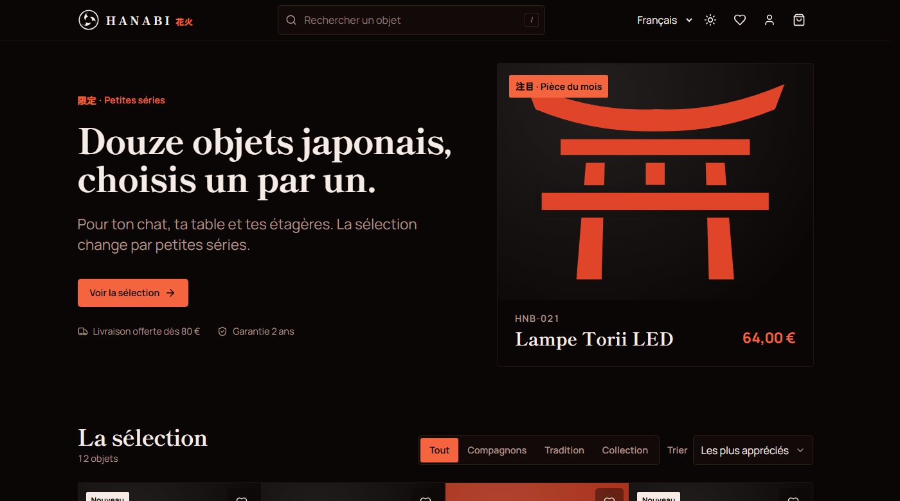
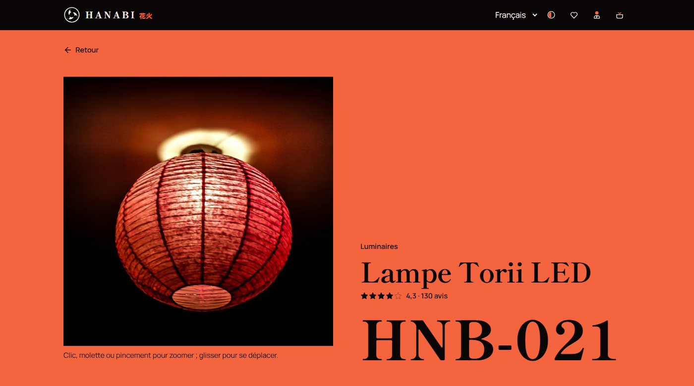
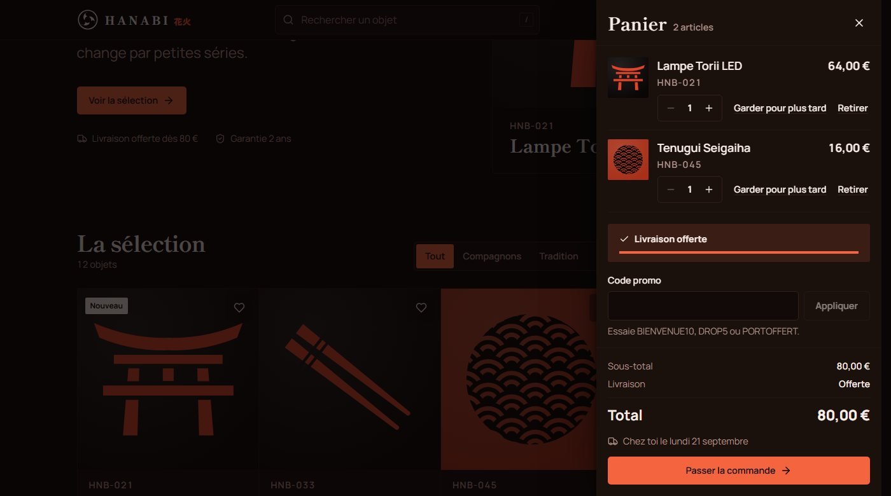
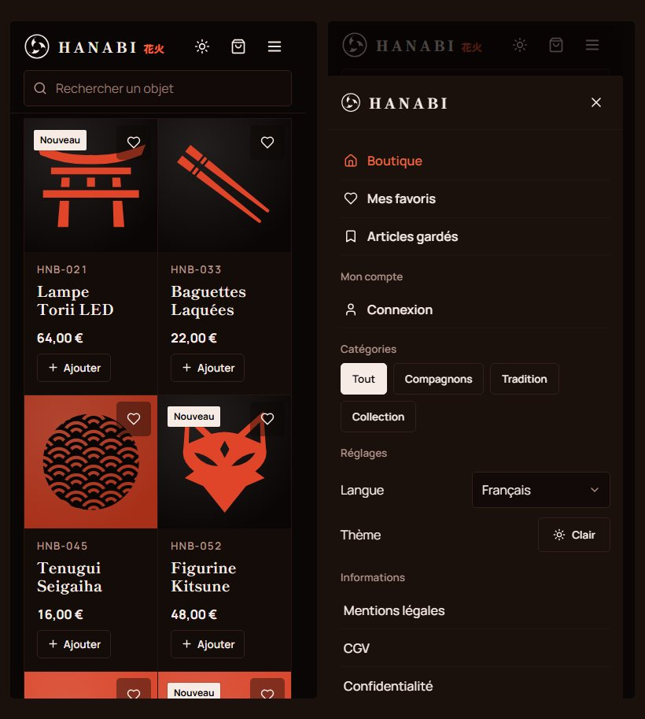
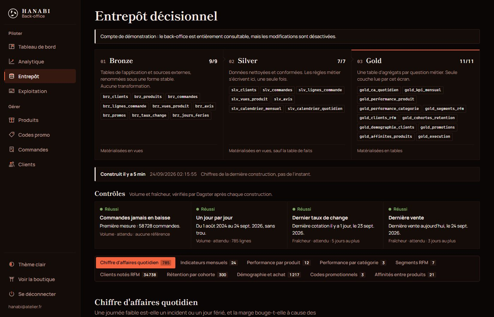

# Hanabi 花火

Boutique en ligne fictive d'objets japonais, avec sa chaîne de données : la
boutique produit les événements, un entrepôt dbt les transforme, le back-office
lit les agrégats.

La boutique sert d'abord de source : 100 000 comptes, 59 000 commandes, 90 000
lignes de commande et 700 000 consultations de fiche à modéliser.

Conçu et développé par Souleiman MECHERI.

[Voir le site](https://hanabi-6x9.pages.dev) ·
[Back-office](https://hanabi-6x9.pages.dev/admin) ·
[L'entrepôt en détail](hanabi-dwh/README.md)



> Boutique fictive, sans activité commerciale. Aucun paiement n'est encaissé et
> aucune commande n'est expédiée.

---

## Aperçu

**Direction artistique.** Deux matières, la laque noire et le vermillon, plus le
papier washi pour le thème clair. Le catalogue réunit figurines, décoration et
luminaires venus des yokai, des estampes et des animés, sans personnage sous
licence. Chaque objet est photographié (photos Unsplash, crédits dans les
mentions légales) ; un objet sans photo reçoit un blason dessiné en SVG, sur la
grammaire des kamon. Titres en Shippori Mincho, texte en Manrope.

La fiche pose l'objet sur une plaque de vermillon pleine largeur. La photo
s'agrandit au clic, à la molette, au pincement ou au clavier.



Panier en tiroir, avec codes promo applicables d'un clic, jauge de livraison
offerte, date de livraison estimée et total recalculé par le serveur.



Le thème suit le réglage du système jusqu'au premier choix, qui est mémorisé.


Sur téléphone, la navigation passe dans un menu en tiroir.



Le back-office reprend la même charte, en plus dense. L'onglet Entrepôt montre
les trois couches, la fraîcheur de la dernière construction, les contrôles de
volume et de fraîcheur, chaque table d'agrégats avec la question qu'elle traite,
et une console SQL en lecture seule. Capture faite sur un entrepôt réellement
construit, à partir d'une base remplie comme celle de production.



---

## La chaîne de données

```
public                 ┐
tables applicatives    │   bronze            silver             gold
écrites par l'API      ├→  10 vues       →   8 modèles      →   12 tables
                       │   aucune            règles métier      une par
externe                │   transformation    écrites une fois   question
2 sources publiques    │                                            ↓
avis lus par un modèle ┘                                back-office + boutique
```

30 modèles dbt, 133 tests, déclarés comme un graphe d'actifs Dagster et
reconstruits chaque jour. Le détail est dans
[hanabi-dwh/README.md](hanabi-dwh/README.md).

### Ce que disent les avis

**La note dit qu'un client est déçu, le texte dit de quoi.** Avant dbt, un actif
Dagster fait lire chaque texte d'avis par un modèle de langue, qui rend les
aspects nommés et leur ton : « Belle finition, livraison un peu longue » donne
qualité positive et livraison négative. Neuf thèmes, dans une liste fermée
(qualité, esthétique, conformité aux photos, taille, livraison, emballage, prix,
cadeau, service) : l'entrepôt compte des catégories stables, pas du texte libre.
`gold_themes_avis` donne, par objet et par thème, les mentions, les reproches et
la note moyenne des avis qui en parlent.

**Un texte n'est lu qu'une fois.** La clé est l'empreinte du texte, que
PostgreSQL calcule des deux côtés : dix avis identiques font un appel, et une
exécution quotidienne ne paie que les nouveaux avis. Changer la consigne, c'est
changer sa version, et tout est relu au passage suivant. Seul le texte part chez
le fournisseur, ni l'auteur ni l'objet. Sans fournisseur, la table reste vide et
l'entrepôt se construit ; une panne n'arrête que l'analyse, reprise le lendemain.

**Mesuré avant d'être compté.** 62 avis étiquetés à la main avant la consigne :
tous les textes de la base, plus des pièges (négation, ironie, anglais, espagnol,
tentative d'injection). Un bon thème au mauvais ton compte faux. Les étiquettes
défendables mais non retenues sont tolérées, ni justes ni fausses. Le seuil, F1 à
0,80, est fixé avant la première mesure.

**Bronze en vues, colonnes énumérées.** Rien n'est dupliqué, et une colonne
ajoutée à `users` n'entre dans l'entrepôt que si on l'y fait entrer. Le condensat
des mots de passe, les photos en base64 et les coordonnées des clients (nom,
e-mail, téléphone, adresses) restent dehors : un client s'y désigne par son
identifiant.

**Règles métier en silver, écrites une fois.** La définition du chiffre
d'affaires, répétée dans quinze requêtes de l'API, tient dans une colonne
`est_ca`.

**Marge et catégorie figées à l'achat.** Prix, coût et catégorie sont copiés dans
la ligne de commande : un nouveau tarif fournisseur ne réécrit pas les mois clos,
et un objet reclassé emporte son audience et son stock, pas ses ventes passées.
Reclasser la Lampe Torii LED aurait sinon fait passer 258 944 €, 60 % des
luminaires, dans la décoration.

**Séries construites sur le calendrier.** Un mois sans commande sort à zéro au
lieu de disparaître de la courbe.

`dbt build` construit et teste dans l'ordre du graphe : un test en échec bloque
l'aval. Les 133 assertions couvrent unicité, non-nullité, intégrité
référentielle, valeurs acceptées et intervalles. Trois sont des réconciliations :
trois calculs du chiffre d'affaires doivent donner le même nombre, la table des
segments doit totaliser celle des clients, et les familles celle des produits.
Une autre vérifie qu'une construction incrémentale redonne les chiffres d'une
construction complète ; la CI construit l'entrepôt deux fois sur un PostgreSQL
jetable pour la jouer.

### Deux défauts que les tests laissaient passer

Les scores RFM classaient les valeurs distinctes au lieu de la population. Avec
679 anciennetés sur deux ans, « récence 5 » voulait dire « dans les 136
premières valeurs », et non « parmi les 20 % de clients les plus récents ».
Toutes les assertions passaient.

| | avant | après |
| --- | ---: | ---: |
| clients notés R=5 | 73 % | 19,9 % |
| segment « À risque » | 19 clients, 0,1 % du CA | 5 430 clients, 23,1 % du CA |

Chaque valeur est désormais notée au rang médian de son groupe d'ex aequo,
exprimé en part de population.

La référence de `gold_ca_quotidien`, moyenne des quatre jours précédents de même
nature, se calculait en incrémental dans les seuls 30 jours reconstruits. Le premier
jour de chaque nature sortait sans référence, les suivants avec une moyenne sur trop
peu de jours (4 083 € au lieu de 3 606 €), et chaque jour sorti de la fenêtre
restait faux. La construction complète était juste : seule une seconde construction,
incrémentale, le montre. La CI construit désormais deux fois, et un test recalcule
la référence sur la table entière.

### Réseau, concurrence, paiement

**Commande idempotente.** Le navigateur tire une clé avant l'envoi et la répète
en cas de réessai ; le serveur stocke la clé avec sa réponse et la rejoue. L'unicité
repose sur une contrainte de base : un `SELECT` préalable laisserait passer la
seconde requête d'un double envoi.

**Courriel écrit dans la transaction de la commande** (*transactional outbox*).
Une tâche de fond le remet ensuite avec des réessais espacés : une panne du relais
ne fait plus échouer un achat payé. Remise au moins une fois.

**Paiement simulé, échecs jouables.** Le cas délicat est l'issue indécise : un
délai dépassé ne dit pas si le débit a eu lieu. La commande reste alors en attente
de rapprochement, stock retenu, réponse 202. Une première version annulait tout ;
l'annulation emportait la ligne d'idempotence, et le second débit redevenait
possible.

**Stock.** Décrément par `UPDATE ... WHERE stock >= qty` et contrainte
`CHECK (stock >= 0)`. Le test lance douze fils d'exécution derrière une barrière
de départ sur le même article : une seule commande passe.

### La recherche

**Par le sens, dans les trois langues.** « veilleuse pour une chambre d'enfant »
trouve les deux lampes, « regalo zorro » le renard, « masque de démon » le masque
Hannya. Un modèle de plongement multilingue (multilingual-e5-small, licence MIT,
export ONNX quantifié) tourne dans l'API, sans service externe ni coût par
requête. Le processus complet tient en 300 Mo, sous les 512 Mo de Render : le
découpeur `tokenizer.json` du dépôt du modèle en prenait 250 à lui seul, le
modèle SentencePiece d'origine découpe à l'identique pour 40.

**Trois étages.** Le prix se lit par expressions régulières (« moins de 30 € »,
« entre 30 et 40 », « under 40 ») : un modèle de sens lit mal les nombres. Le texte
tolère une faute de frappe (« kokechi »). Le sens retient un objet quand il se
détache du reste du catalogue, et les mots retrouvés dans sa fiche renforcent cet
écart : ce modèle donne 0,80 à « pizza » contre un renard en résine, un seuil
absolu ne tiendrait pas. Sans modèle, les deux premiers étages répondent seuls.

**Des usages sur chaque fiche, dans les trois langues.** « Lampe lune, 16
couleurs, télécommande » ne dit pas que c'est une veilleuse. Chaque objet porte
des usages (pièce, occasion, public), invisibles pour le client et modifiables
dans le back-office. Leurs traductions reprennent les lignes françaises une à
une, sans rien y ajouter.

**Mesurée avant d'être réglée.** Deux séries de requêtes de référence : 36 pour
régler les seuils et les usages, 37 écrites avant tout essai et jamais utilisées
pour régler. Une requête réussit quand ses objets attendus sont en tête ; les
requêtes de prix exigent exactement les bons objets, et « pizza », « katana » ou
« thé matcha » doivent rester sans réponse.

| requêtes réussies | réglage (36) | contrôle (37) |
| --- | ---: | ---: |
| recherche d'avant, par sous-chaîne | 11 | 14 |
| texte et prix | 30 | 25 |
| texte, prix et sens | 32 | 31 |

Les deux réglages du sens sont pris au centre de la zone où le banc plafonne,
loin de ses bords. La série de contrôle a été mesurée trois fois : 29 ; 30 après
un correctif dicté par un test unitaire (« art » trouvait « artisanat ») ; 31 une
fois les usages traduits, les réglages refaits sur la seule série de réglage.
Les deux séries et les usages sont de la même main, ce qui reste la limite de ce
banc.

**Reproductible.** Le modèle quantifié calcule l'échelle de ses activations sur
tout le lot : un texte encodé avec d'autres bougeait de 0,002, assez pour changer
un résultat selon les objets voisins. Chaque texte s'encode seul, en 5 ms.

**Tenue à l'échelle.** Sur mille objets fictifs, une recherche répond en moins de
15 ms. Chaque mot de la requête se compare une fois au vocabulaire du catalogue,
et non à chaque fiche (250 ms auparavant). Le catalogue s'encode au démarrage dans
un fil à part, puis seules les fiches modifiées sont réencodées.

### Des fiches traduites en base

Les traductions anglaises et espagnoles vivaient dans le code : un objet ajouté
depuis le back-office restait en français sur les deux autres versions du site.
Elles passent en base avec les usages et un texte alternatif pour la photo
principale, et se modifient dans le back-office. Un champ vide reprend
l'anglais, puis le français : une fiche traduite à moitié reste lisible.

### L'assistant de fiche produit

**Une fiche en trois langues à partir d'une photo.** Écrire le nom, l'accroche,
les usages et le texte alternatif en français, en anglais et en espagnol est ce
qui freinera l'arrivée de nouveaux objets. Dans le back-office, l'assistant lit
le nom, la photo principale et quelques notes, puis propose la fiche entière. La
proposition remplit le formulaire ; la version d'avant reste à un clic, et rien
n'est enregistré sans relecture.

**Un fournisseur choisi au déploiement.** Le code parle le format « chat
completions » : l'adresse, la clé et le modèle sont des variables
d'environnement. Seuls le texte et la photo de l'objet partent chez le
fournisseur, jamais une donnée de client. Sans configuration, le panneau
n'apparaît pas.

**Une réponse vérifiée, pas crue.** Elle doit être un JSON à la forme exacte :
catégorie parmi les trois, longueurs bornées, autant de lignes d'usages dans
chaque langue. Invalide, elle est redemandée une fois avec l'erreur ; invalide
encore, l'assistant le dit au lieu de remplir le formulaire. Une photo que le
fournisseur refuse est abandonnée plutôt que de faire échouer la demande, et le
texte alternatif reste alors vide : sans photo vue, il serait inventé. La
consigne interdit d'inventer une dimension ou une matière, et quelques fiches du
catalogue lui donnent le ton.

**Un coût borné.** Chaque demande laisse une ligne en base (l'heure, la
démonstration ou non, l'issue, aucune personne) : le plafond du jour tient après
un redémarrage. Le compte de démonstration a son propre plafond ; il essaie
l'assistant sans pouvoir enregistrer, ni épuiser le quota du marchand.

**Évalué sur la recherche.** `tests/redaction/evaluer.py`, hors de la suite car
il appelle le vrai fournisseur, fait rédiger les fiches du catalogue de départ,
contrôle les règles (aucun nombre absent des notes, longueurs, lignes
parallèles), puis rejoue le banc de recherche avec les usages de l'assistant à
la place de ceux écrits à la main. Les tests de la suite passent par un faux
fournisseur : réponses invalides, photo refusée, clé refusée, panne, plafonds.

### Le conseiller cadeau

**Un vendeur qui connaît la boutique.** Sur l'accueil, on décrit à qui l'on
offre : « pour ma sœur qui adore les yokai, 50 € maximum ». Le conseiller
propose un à trois objets, du plus au moins adapté, et dit pourquoi chacun
convient.

**Le modèle choisit, la base affirme.** Le serveur lit le budget dans la phrase,
écarte ce qui est épuisé ou hors budget, classe le reste avec la recherche et ne
montre que ces candidats au modèle. Celui-ci rend des codes de la liste et une
raison par objet ; le nom, le prix, le stock et la photo viennent de la base. Un
code hors liste, un objet proposé deux fois ou une raison qui cite un prix sont
refusés et redemandés une fois. Un seul appel par demande, aucun quand rien
n'est en stock dans le budget. Pas de boucle d'outils : avec une présélection
faite côté serveur, elle ajouterait de la latence sans ajouter de garantie.

**Une fonction publique qui coûte.** Preuve anti-robots, trois demandes par
minute et vingt par jour pour une même adresse IP, plafond global du jour compté
en base. Le texte de la demande part chez le fournisseur pour y répondre et
n'est conservé nulle part ; le journal ne garde que l'heure, l'issue et le
nombre d'objets proposés. Le formulaire le dit, et la politique de
confidentialité ajoute ce destinataire.

**Mesuré en deux temps.** Ce que le serveur montre au modèle se mesure en CI,
sans fournisseur : sur 19 demandes en trois langues, le budget est toujours
tenu, et un objet acceptable figure dans les trois premiers candidats 18 fois,
avec ou sans modèle de sens. Le choix du modèle se mesure à la main
(`tests/conseil/evaluer.py`). Un faux fournisseur qui prend simplement les deux
premiers candidats obtient déjà un objet acceptable pour 17 demandes sur 18, et
le bon premier choix pour 14 : c'est le plancher qu'un vrai modèle doit battre,
sur le premier choix et sur la justesse des raisons.

### Le formulaire de paiement

**La carte se reconnaît sans rien envoyer.** Le réseau se lit aux premiers
chiffres et s'affiche par sa marque ; la banque sort d'une table de 2 379 BIN tirée
de bin-list-data (CC BY 4.0, `scripts/banques.js`), chargée au premier focus du
champ (6 ko). Elle ne garde que les 32 banques que les clients connaissent sous ce
nom : un sous-traitant technique affiché à la place de la banque inquiéterait. Le
service gratuit en ligne (binlist.net) plafonne à cinq requêtes par heure et ne
connaissait pas le BIN français essayé. Seize chiffres dont la clé de Luhn est
fausse sont annoncés comme une faute de frappe, et non comme un numéro incomplet.

**L'adresse se propose.** Les suggestions viennent de la Base Adresse Nationale
(Géoplateforme de l'IGN, gratuite, sans clé) ; en cas de panne, le champ redevient
un champ ordinaire. Le code postal n'accepte que cinq chiffres, sans longueur
maximale sur le champ : elle tronquait un code collé avec une espace avant que le
filtre ne passe. Un code qui ne désigne qu'une commune remplit la ville.

### Le compte

Informations, cartes enregistrées, mot de passe et adresse de connexion.

- **Aucun numéro ni cryptogramme en base** : réseau, quatre derniers chiffres,
  expiration et jeton opaque du prestataire. Le navigateur n'envoie rien d'autre,
  un test le vérifie sur le fil.
- **Mot de passe courant exigé** pour changer ce qui donne accès au compte. La
  nouvelle adresse repart non confirmée.
- **Seuls les champs modifiés partent**, pour ne pas écraser un autre onglet.
- **Aucun identifiant de compte dans les routes** : elles agissent sur le porteur
  du jeton. La carte d'un autre rend 404.

### Effacement et portabilité

Un client peut exporter ses données et supprimer son compte. La suppression
anonymise : le Code de commerce impose de garder dix ans les pièces comptables, ce
que le RGPD prévoit (art. 17-3-b).

| | |
| --- | --- |
| Effacé | moyens de paiement, jetons, alertes de stock, abonnement, courriels en file, adresses de livraison |
| Conservé, délié | commandes et montants, texte des avis, volume de navigation |

L'adresse de remplacement est en `.invalid` (RFC 2606) et le condensat devient une
valeur que bcrypt ne produit jamais. Le test parcourt toutes les colonnes
textuelles du schéma à la recherche des valeurs personnelles : une table oubliée
dans `rgpd.anonymiser` le fait échouer.

### Parcours de bout en bout

Dix-huit parcours Playwright contre une vraie API sur un SQLite jetable, barrières
anti-robots actives. Le plus utile vérifie qu'après une coupure réseau, le réessai
porte la même clé d'idempotence que la première tentative. Un autre paie avec la
carte de test `4000 0000 0000 0002` et attend le refus de la banque : le numéro
reste dans le navigateur, seul le jeton qu'il désigne part au paiement simulé.
Deux surveillent le bandeau cookies : un refus tient au rechargement, et sans
accord la fiche consultée part sans jeton, même pour un client connecté. Quatre
couvrent le formulaire de paiement ; le service d'adresses y répond par une
réponse fixe, pour qu'aucun parcours ne dépende du réseau.

### Cookies et mesure d'audience

Une seule finalité demande un accord : rattacher les fiches consultées au compte
connecté. Le bandeau la présente avec deux boutons identiques, refuser et accepter,
garde le choix six mois (recommandation de la CNIL) et se rouvre depuis « Gérer mes
cookies » en pied de page. Sans accord, la consultation est comptée sans jeton ni
identifiant. Au démarrage, l'API détache du compte les consultations de plus de
treize mois ; l'entrepôt n'utilise que les totaux par produit et par mois.

Les polices sont servies par le site (107 ko, sous-ensembles latin et les six
idéogrammes affichés) : plus aucune requête vers Google. Les photos passent par le
CDN d'Unsplash, qui ne dépose pas de cookie ; la politique de confidentialité le
déclare comme destinataire de l'adresse IP, comme la Géoplateforme de l'IGN qui
reçoit l'adresse en cours de saisie au paiement.

### Courriels promis, courriels envoyés

- **Retour en stock** : la demande faite sur la fiche part au réassort (back-office
  ou commande annulée), une fois, dans la langue de la page, puis se ferme.
- **Désinscription** : chaque lettre porte un lien signé (HMAC du numéro
  d'inscription, sans l'adresse dans l'URL) ; un clic suffit.
- **Confirmation de commande** : elle rappelle l'adresse de livraison, gardée sur
  la commande et effacée avec le compte.

### Accessibilité et poids

Couples de couleurs mesurés dans les deux thèmes, 4,5:1 au minimum, y compris le
texte posé sur le vermillon (`--on-accent`) et les cases de la heatmap des
cohortes. Palette des graphiques validée pour les daltonismes courants ; aucun
statut porté par la couleur seule.

`npm run build` échoue si un lot dépasse son budget :

| lot | transféré (gzip) | plafond |
| --- | ---: | ---: |
| `index` (React et le socle) | 45,4 ko | 51 ko |
| `App` (la boutique) | 60,4 ko | 63 ko |
| `Admin` (chargé à la demande) | 25,0 ko | 28 ko |
| CSS | 16,5 ko | 22 ko |

Le paiement (5 ko) se charge à l'ouverture du panier, avant le clic qui y mène.

### Fluidité

Mesures sur le build de production, écran à 165 Hz :

| | avant | après |
| --- | ---: | ---: |
| Images au premier affichage | 1 956 ko | 246 ko |
| Trames perdues pendant un zoom (molette, glisser) | | 0 |
| Trames perdues au défilement (accueil, fiche) | 0 | 0 |
| Interaction la plus lente (ajout au panier) | | 24 ms |
| Premier affichage / plus grand élément | | 128 / 436 ms |
| Décalage de mise en page cumulé | | 0,002 |

Chaque photo porte un `srcset` : le CDN redimensionne, le navigateur prend la
largeur affichée. `src` est posé en dernier, sinon React lançait le téléchargement
en 1 200 px avant de lire `loading` et `srcset`. La vue principale d'un écran part
en tête de file, les autres vues d'une fiche se préchargent au repos, déjà
décodées. La photo d'une fiche se zoome au clic, à la molette, au pincement ou au
clavier ; le cadrage passe par `transform` sans re-rendu React, et une version en
1 800 ou 2 400 px arrive dès qu'on agrandit. Les sections hors écran (`content-visibility`) ne sont calculées qu'à
l'approche, la jauge du panier avance par `transform` et non par sa largeur, et
ajouter un article ne fait plus re-rendre toute la grille. Sur Cloudflare Pages,
les fichiers à empreinte et les polices sont mis en cache un an (`public/_headers`).

### Exploitation

Chaque requête porte un identifiant, repris dans la réponse et dans des journaux
JSON en production ; les adresses IP y sont tronquées. `/health` fait un
aller-retour jusqu'à la base et répond 503 si elle ne suit pas.

Les courriels sortent par défaut en `.eml` dans `var/courriels/`, message MIME
complet. `MAIL_BACKEND=smtp` bascule sur un vrai relais (voir `.env.example`).
L'onglet Exploitation du back-office affiche la file et les paiements à rapprocher.

### Ce que les visiteurs cherchent

**Les demandes sans réponse deviennent une liste d'achats.** Une recherche qui ne
rend aucun objet est gardée trente jours, sans compte ni adresse. Quand le
conseiller ne trouve rien, il rend aussi le besoin en quelques mots génériques
(« coque de téléphone ») : seul ce libellé est gardé, la demande reste oubliée
comme la page le promet. Le tableau de bord les regroupe en besoins, du plus au
moins demandé. Le modèle dit quelles lignes vont ensemble ; les comptes sont faits
par le serveur, qui écarte un numéro inventé ou répété. Le compte de
démonstration voit les besoins, jamais ce que les visiteurs ont tapé.

**Le conseiller lit les avis.** Chaque objet candidat arrive avec ce que ses avis
louent ou reprochent nettement, tiré de `gold_themes_avis` : trois mentions au
moins, la livraison et l'emballage exclus puisqu'ils parlent de la boutique. Il
peut s'appuyer sur un point loué, écarter un objet qu'un reproche disqualifie, et
ne prête aux clients rien d'autre.

### Demander à l'entrepôt

**Une question en français, une requête qu'on peut lire.** Dans l'onglet
Entrepôt, « quel segment pèse le plus dans le chiffre d'affaires ? » devient une
requête SQL sur les tables gold, exécutée par la console et ses garde-fous. La
réponse montre la phrase qui dit ce que calcule la requête, le tableau, le SQL,
et un bouton qui le reprend dans la console : rien n'est caché, tout se vérifie.

**Le modèle écrit, la console exécute.** Il ne lit que gold, même pour un
administrateur qui a droit à bronze et silver : ce sont les tables d'agrégats,
sans ligne par personne. Il connaît les tables par le registre du back-office (la
question métier de chacune), les colonnes lues dans la base au moment même, et
les valeurs des colonnes de texte qui en ont peu : « Fideles » s'écrit sans
accent, et c'est la base qui le dit. Une requête refusée par la base lui revient
avec l'erreur, une fois. Il refuse une demande de données personnelles, une
écriture ou une question hors de ces tables, en disant pourquoi.

**Un banc qui ne dépend pas du modèle.** 22 questions de référence, dont trois à
refuser, avec leur requête. Une réponse est juste quand son résultat contient,
pour chaque colonne de la référence, une colonne aux mêmes valeurs : les noms et
les colonnes en plus ne comptent pas. La CI exécute chaque requête de référence
sur l'entrepôt qu'elle vient de construire, à travers la console : un renommage
dans dbt casse le banc tout de suite, pas le jour de l'évaluation.

### La console SQL

Cinq barrières : transaction en lecture seule, délai de cinq secondes, tables lues
relevées dans le plan `EXPLAIN` (une CTE vers `public.users` est refusée), contrôle
de forme, compte administrateur. Plus une limite de débit, le compte de
démonstration étant public.

### Le compte de démonstration

Ses identifiants sont affichés à la connexion. Il lit tout le back-office et
n'écrit rien, refus posé côté serveur. Toute route qui rend un nom, une adresse
e-mail, une ville ou une adresse de livraison la masque pour lui : clients,
commandes, alertes, tableau de bord, meilleurs clients, segments RFM. L'entrepôt ne
copie aucune coordonnée (un client y est un identifiant), et la console ne lui
ouvre que les agrégats (`gold`).

### L'entrepôt dans la vitrine

« Souvent achetés ensemble » lit `gold_affinites_produits`, trié par lift et limité
aux paires au-dessus de 1.

### Orchestration

Deux extractions Python, l'analyse des avis et 30 modèles dbt forment un seul
graphe Dagster. Avant,
les étapes étaient listées à la main dans le workflow et l'extraction des taux
n'y figurait pas : bronze lisait une table que rien n'alimentait. Désormais
`brz_taux_change` dépend de l'extraction et l'ordre se déduit du graphe. Un échec
n'arrête que l'aval, et la série de taux se rejoue par partition mensuelle.

Sans daemon hébergé, GitHub Actions reste l'horloge et appelle le graphe.

### Limite d'architecture

PostgreSQL est un moteur en lignes. À volume analytique réel, le médaillon irait
dans un moteur en colonnes (ClickHouse, DuckDB, BigQuery) et Neon resterait la
source.

---

## En résumé

| Domaine | Réalisations |
| --- | --- |
| Données | Médaillon dbt sur PostgreSQL, 30 modèles, 133 tests, orchestration Dagster par partitions, avis lus par thème et par ton, console SQL bridée, questions en français traduites en SQL sur gold |
| Interface | Charte laque et vermillon, photos produit et blasons SVG en repli, thème clair et sombre, 3 langues, menu en tiroir |
| Recherche | Par le sens dans les trois langues, modèle embarqué sans service externe, banc de 73 requêtes dont 37 de contrôle, conseiller cadeau qui ne propose que des objets en stock et dans le budget |
| Achat | Déclinaisons (une couleur, son prix, son stock, sa photo), panier persistant, articles gardés, favoris, codes promo, livraison estimée, annulation d'un retrait |
| Back-office | Tableau de bord, analytique (rentabilité, prévisions, cohortes, RFM, affinités), entrepôt, exploitation, assistant de fiche en trois langues |
| Sécurité | Anti-robots (preuve de travail en Web Worker, pot de miel, délai de saisie), limitation par compte et par IP, en-têtes durcis |
| Fiabilité | Commande idempotente, outbox transactionnelle, stock concurrent, journal structuré |
| Conformité | Mentions légales, CGV versionnées et acceptées côté serveur, RGPD art. 17 et 20, bandeau de consentement, polices hébergées sur le site |
| Accessibilité | Focus piégé dans les fenêtres, clavier, contraste mesuré, `prefers-reduced-motion` |
| Qualité | 676 tests API sur SQLite et PostgreSQL, 297 tests d'interface, 18 parcours e2e, 133 assertions dbt, 35 tests de l'orchestration, budget de poids |

---

## Stack

React 18 et Vite, sans bibliothèque de composants, de CSS, de routage ni
d'animation. Seule dépendance d'exécution en plus de React : `lucide-react`.

FastAPI, SQLAlchemy 2 et Pydantic v2 ; SQLite en local, PostgreSQL (Neon) en
production ; JWT et bcrypt. La recherche par le sens tourne avec onnxruntime et
sentencepiece, sans PyTorch.

dbt sur PostgreSQL, orchestré par Dagster.

---

## Démarrer en local

Prérequis : Node 20+ et Python 3.11+.

```bash
cd hanabi-back
python -m venv .venv
.venv/Scripts/activate
pip install -r requirements.txt
cp .env.example .env
uvicorn app.main:app --reload
```

La recherche par le sens demande son modèle (120 Mo, révision figée, empreintes
vérifiées). Sans lui, la recherche par le texte et le prix répond seule :

```bash
cd hanabi-back && .venv/Scripts/python -m app.plongement
```

```bash
cd hanabi-front
npm install
npm run dev
```

Boutique sur `http://localhost:5173`, back-office sur `/admin`, documentation de
l'API sur `http://localhost:8000/docs`.

L'entrepôt est facultatif et demande PostgreSQL :

```bash
cd hanabi-dwh
python -m venv .venv
.venv/Scripts/pip install -r requirements.txt
.venv/Scripts/python dwh.py build
```

Sans entrepôt, l'onglet correspondant affiche la commande à lancer. Le graphe
Dagster s'ouvre sur `http://localhost:3000` :

```bash
cd hanabi-dwh && .venv/Scripts/dagster dev
```

Un client d'essai est créé au démarrage (`demo@hanabi.fr` / `demo1234`).
L'administrateur vient de `ADMIN_EMAIL` et `ADMIN_PASSWORD` ; sans ces variables,
aucun n'est créé. Le mot de passe est repris de la variable à chaque démarrage.

---

## Tests

```bash
cd hanabi-back && .venv/Scripts/python -m pytest tests/ -q
```

Le banc d'essai de la recherche affiche chaque requête et son résultat :

```bash
cd hanabi-back && .venv/Scripts/python tests/recherche/banc.py
```

L'évaluation de l'assistant appelle le fournisseur configuré, un appel par objet :

```bash
cd hanabi-back && .venv/Scripts/python tests/redaction/evaluer.py
```

```bash
cd hanabi-back && .venv/Scripts/python tests/conseil/evaluer.py
```

Celle des questions à l'entrepôt demande en plus un entrepôt construit
(`DATABASE_URL` vers sa base) :

```bash
cd hanabi-back && .venv/Scripts/python tests/entrepot/evaluer.py
```

Celle des avis n'a besoin d'aucune base :

```bash
cd hanabi-dwh && .venv/Scripts/python tests/avis/evaluer.py
```

```bash
cd hanabi-front && npm run lint && npm run format:check && npm test && npm run build
```

```bash
cd hanabi-front && npm run e2e
```

```bash
cd hanabi-dwh && .venv/Scripts/dbt parse --profiles-dir . --project-dir . && .venv/Scripts/dagster definitions validate
```

Côté API : prix et remises, stock en concurrence, authentification, anti-robots,
cloisonnement du back-office, export CSV, notation RFM, anonymisation, migrations.
La suite tourne sur SQLite, et la CI la rejoue sur PostgreSQL 16, le moteur de la
production : verrous de ligne, types et contraintes que SQLite laisse passer.

Côté interface, les tests visent des propriétés plutôt que des valeurs figées :

- le lissage Fritsch-Carlson des courbes ne dépasse jamais les points mesurés
  (échantillonnage des Bézier produites) ;
- les dictionnaires anglais et espagnol couvrent toutes les clés du français, avec
  les mêmes marqueurs ;
- frais de port et seuil de gratuité sont comparés entre `lib/constants.js` et
  `app/pricing.py`.

Ces tests ont trouvé deux défauts à leur première exécution : `niceTicks` rendait
une graduation haute sous le maximum de la série, et `estimateDelivery` gardait
l'heure de la commande.

---

## Structure

```
hanabi-back/          API FastAPI
  app/
    routers/          points d'entrée HTTP
    pricing.py        calcul des montants
    analytics.py      calculs du back-office sur la base transactionnelle
    warehouse.py      lecture des agrégats dbt, console SQL
    recherche.py      recherche du catalogue : prix, texte, sens
    plongement.py     modèle de plongement, téléchargement vérifié
    fournisseur.py    accès neutre au fournisseur de modèle de langue
    redaction.py      assistant de fiche produit, plafond du jour
    conseil.py        conseiller cadeau : candidats, choix vérifiés
    question_entrepot.py  questions en français, traduites en SQL sur gold
    rgpd.py           portabilité et effacement
    idempotency.py    rejeu des requêtes non répétables
    outbox.py         file des courriels
    payments.py       autorisation simulée
    observability.py  identifiant de requête, journal structuré
  tests/

hanabi-front/         Interface React
  src/
    components/ pages/ hooks/ lib/ i18n/
    styles/           charte et CSS par domaine
    admin/            back-office, chargé à la demande
  e2e/                parcours Playwright

hanabi-dwh/           Entrepôt (dbt + Dagster)
  models/bronze/ models/silver/ models/gold/
  ingestion/          sources publiques (BCE, jours fériés)
  orchestration/      graphe d'actifs
```

Conventions et pièges connus : [CONTRIBUTING.md](CONTRIBUTING.md).

---

## Limites connues

- **Paiement non branché.** La carte est validée (Luhn, réseau) mais rien ne
  quitte le navigateur ; un vrai branchement passerait par les composants du
  prestataire.
- **Banque indicative.** La table des BIN n'est pas officielle et date de février
  2025 ; sur un BIN qu'elle ne connaît pas, elle n'affiche rien plutôt que de deviner.
- **Photos en base64 dans la base** pour celles qu'on téléverse depuis le
  back-office. La réponse du catalogue grossit avec elles ; la suite logique est un
  stockage objet.
- **Un seul cliché par objet**, que l'on agrandit à volonté : Unsplash n'a pas
  d'autre angle de ces objets précis. De vraies prises de vue compléteraient les
  galeries.
- **Reconstruction planifiée conditionnée à `DWH_DATABASE_URL`** dans les secrets du
  dépôt. GitHub désactive aussi les tâches planifiées après soixante jours sans
  activité.
- **Mentions légales à compléter.** Aucune identité d'entreprise n'est inventée.
- **Anti-robots en mémoire du processus.** Plusieurs instances demanderaient Redis.
- **Messages de l'API en français**, quelle que soit la langue de l'interface. Les
  courriels déclenchés depuis une page (lettre, retour en stock) suivent sa langue.
- **Panier et favoris en `localStorage`**, donc propres à un appareil.
- **Assistant et conseiller évalués hors de la CI.** Leur évaluation coûte des
  appels et demande une clé ; elle se lance à la main, et à chaque changement de
  consigne ou de modèle.
- **Vecteurs du catalogue en mémoire.** Ils se recalculent à chaque démarrage :
  quelques secondes aujourd'hui, une vingtaine pour mille objets. Au-delà, ils
  iraient en base.

---

## Mise en ligne

[DEPLOY.md](DEPLOY.md) : hébergement gratuit, variables d'environnement,
vérifications.

## Auteur

Souleiman MECHERI : conception, interface, API, chaîne de données, sécurité, mise
en ligne.

## Licence

Tous droits réservés, voir [LICENSE](LICENSE). Code consultable pour évaluation ;
reproduction, redistribution, modification et usage commercial soumis à accord
écrit.

Une faille à signaler : [SECURITY.md](SECURITY.md).
